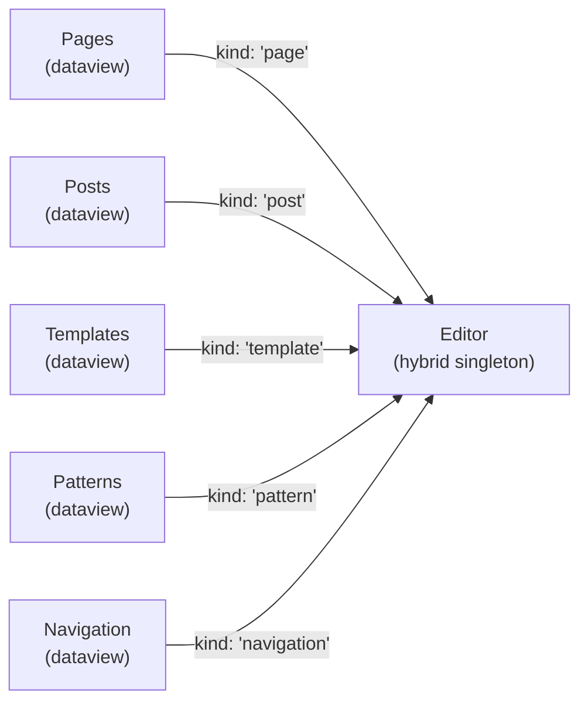
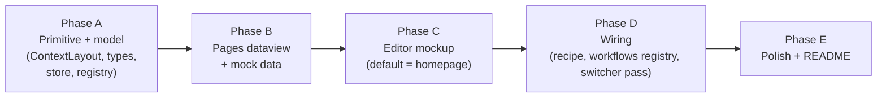

## 1. Why this slice exists

Today every classic-admin destination — Posts, Pages, Media, Comments, Products, Users, Appearance, Plugins, Tools — routes through the same stub `edit-page` context. The model has no way to express WordPress's most-repeated loop:

> Find content in a list → open one item → edit it → return to the list.

This slice makes that loop a first-class structural concept in the shell, by introducing two new context kinds, the relationship between them, and a canonical pattern for intra-context navigation that subsequent slices can adopt verbatim.

## 2. The mental model

### Two roles, one verb

- **Manage contexts** — `pages` (this slice), and later `posts`, `templates`, `template-parts`, `patterns`, `navigation`, `products`, `media`, `comments`, `users`, `themes`.
  - Shape: dataview / table / cards
  - Purpose: find, filter, triage, bulk-act
  - Singleton (one Pages, one Posts at a time)

- **Editor context** — `editor`, single context type, **multi-kind**.
  - Shape: full-bleed editing surface (header + canvas + rails)
  - Purpose: deep work on a single block-based document
  - Hybrid singleton (see §4)
  - Cares about `kind` only insofar as document settings vary (e.g. templates expose area/post-type; patterns expose synced/categories). Same chrome, same loop.

- **The verb**: clicking a row in a manage context **opens or focuses** the Editor on that item. The manage context **stays open** so the user can Cmd+Tab back, or close the Editor to fall back to it via the LRU stack.



### What's *not* a dataview

- **Styles** — single global object, not a collection. Stays as its own singleton context (or eventually a section inside Settings).
- **Themes** — manage-shaped (browse / install / activate) but not block-editor adjacent; future slice.
- **Settings** — collection of forms, not a dataview. Uses the same subnav primitive (§3) but its main region is a form, not a table.

### Slice 2 only ships Pages + Editor

Templates, Patterns, Navigation, Posts are intentionally future slices. They're called out here so the model and primitives are shaped to absorb them without rework.

## 3. Internal context navigation: one primitive

Every context that has internal structure uses the same secondary-nav slot. Specifics will vary in content, but the *shape* is shared.

### Examples of what would live in this slot

| Context | What goes in the subnav |
|---|---|
| Pages | Status views: All, Published, Drafts, Scheduled, Trash, + saved views |
| Posts | Status views (same as Pages) + categories |
| Templates | Template kinds: All, Pages, Singles, Archives, Parts, 404, Search |
| Patterns | Categories: All, Headers, Footers, Galleries, Synced, Unsynced |
| Settings | Sections: General, Writing, Reading, Discussion, Media, Permalinks |
| Editor | (exception — its chrome owns both rails for document/inspector) |

### Why a left rail and not top tabs

- Scales to many items (Settings has 6+, Templates 8+).
- Mirrors macOS source lists / Linear / Notion — a familiar "switch within this app" affordance.
- Lives on a different axis from the global admin bar above, so the two don't visually compete.
- Editor is the explicit exception, justified by its full-bleed nature.

### The primitive (`<ContextLayout>` + `<ContextSubnav>`)

Composition-first API in `src/shell/`:

```tsx
<ContextLayout>
  <ContextSubnav collapsible>
    <ContextSubnav.Group label="Status">
      <ContextSubnav.Item active>All pages <Count>24</Count></ContextSubnav.Item>
      <ContextSubnav.Item>Published <Count>18</Count></ContextSubnav.Item>
      <ContextSubnav.Item>Drafts <Count>4</Count></ContextSubnav.Item>
      <ContextSubnav.Item>Scheduled <Count>1</Count></ContextSubnav.Item>
      <ContextSubnav.Item>Trash <Count>1</Count></ContextSubnav.Item>
    </ContextSubnav.Group>
  </ContextSubnav>
  <ContextLayout.Main>
    {/* dataview / form / whatever */}
  </ContextLayout.Main>
</ContextLayout>
```

Behaviour:
- Fixed width (e.g. `w-56`), collapsible to icon-only or hidden via a single chevron in the layout chrome.
- Active item state, optional leading icon, optional trailing badge/count.
- Groups are visual only this slice; reorderable later.
- Selection is the consumer's concern — the primitive emits, the workflow decides.
- Search box / quick filters above the table are *fine-grained* filtering on top of whatever subview is active, and are owned by the workflow, not the primitive.

This is the same primitive Settings will adopt as a fast follow.

## 4. Editor multiplicity: hybrid singleton

This is the most subtle decision in the slice and worth being precise about.

**Default — singleton.** Clicking any page row opens the (single) Editor context and swaps its current document. Clicking About then Contact ends in one Editor showing Contact. Matches the modern WP Site Editor and the macOS Pages app.

**Power-user escape — pinned instance.** Triggered by:
- Row action "Open in new context" in Pages
- Modifier-click on a row (Cmd/Ctrl)
- "Pin this editor" affordance from inside the Editor

Pinned instances become independent contexts that show in the switcher with their document title.

**Implementation — `singletonKey`.**

```ts
type Meta = {
  // ...existing fields
  singletonKey?: (params?: ContextParams) => string | undefined
}
```

Behaviour in `store.open()`:
- If `singletonKey(params)` returns a string, look for an existing context of the same `type` whose key matches; if found, focus it (and apply new params, swapping the document); otherwise create.
- If it returns `undefined`, always create a new context.
- Falls back to the existing boolean `singleton` for unchanged types.

For Editor:
```ts
singletonKey: (params) =>
  params?.instanceId
    ? `editor:${params.instanceId}`     // pinned, unique per instanceId
    : `editor:default`                  // shared default singleton
```

For Pages: `singleton: true` is sufficient.

## 5. Manage → Editor handoff

Click a row in Pages:

1. `open({ type: 'editor', params: { kind: 'page', id } })` is dispatched.
2. Singleton key resolves to `editor:default`. If Editor exists, focus + swap document. If not, spawn.
3. Pages context **remains in `openContexts[]`**, just no longer active.
4. ContextSwitcher / admin-bar switcher show both — Pages + Editor: <doc title>.
5. Closing Editor returns to Pages via the LRU stack.

Modifier / row-action variant:

1. `open({ type: 'editor', params: { kind: 'page', id, instanceId: id } })` is dispatched.
2. Singleton key resolves to `editor:<id>`, distinct from default and from any other pinned instance.
3. New Editor context appears in the switcher.

## 6. Pages — the first dataview

Workflow surface assembled from the new primitive plus a coss/ui `Table`.

- **Subnav (left rail)**: Status views — All / Published / Drafts / Scheduled / Trash, each with counts.
- **Main region**:
  - Toolbar: search input, table density toggle, "Add new" button (opens Editor with `{ kind: 'page', id: 'new' }`)
  - Columns: `Title` (link-styled, click → opens Editor), `Status` (badge), `Author`, `Modified`, row-actions menu (`Edit`, `Open in new context`, `View`, `Trash`)
  - ~16 mock rows — varied statuses and dates so the table feels alive (one row flagged `isFrontPage: true` to anchor the Editor default)
  - Selection column with bulk-action bar (visual only this slice)
  - Empty/loading states stubbed but not focal

Intentionally close to the modern WP dataview pattern so Posts / Templates / Patterns can be near-clones.

## 7. Editor — always has a document

Single visual state, no separate "home":

- **Header**: editable doc title (visual only), status pill (Draft/Published), Save / Preview / Publish buttons (disabled-looking)
- **Left rail** (editor chrome, not the subnav primitive): document settings — Status & visibility, Permalink, Template, Featured image — collapsible groups, all stubs
- **Canvas**: a centered page-like surface containing 4–5 stacked block placeholders (heading, paragraph, image, paragraph, button) styled to evoke Gutenberg without being a working editor
- **Right rail**: tabs for Document / Block, with stub controls
- Context title in the shell becomes "Editor: <doc title>" dynamically

### Default document = the homepage

Opening Editor without params (deep link, classic-admin entry, future "site preview" dashboard widget) resolves to the homepage page id at `open()` time. Encoded as `meta.resolveDefaultParams()`:

```ts
resolveDefaultParams: () => ({ kind: 'page', id: getHomepageId() })
```

This means:
- The Editor never renders an empty/welcome state — there's always a document.
- The future **Site preview dashboard widget** can simply call `open({ type: 'editor' })` and arrive at the homepage in the editor. No special handling needed.
- Stale URLs with no params still land somewhere meaningful.

If we later want a "no document" state for special cases, it's additive — but we're not building it now.

## 8. Files touched / added

```
src/
  shell/
    ContextLayout.tsx     // NEW
    ContextSubnav.tsx     // NEW
  contexts/
    types.ts              // + 'pages', 'editor', editor params shape
    registry.ts           // + meta + DESTINATIONS; singletonKey + resolveDefaultParams
    store.ts              // singletonKey lookup; resolveDefaultParams on open()
  workflows/
    Pages.tsx             // NEW (consumes ContextLayout + ContextSubnav)
    Editor.tsx            // NEW
    index.tsx             // register Pages + Editor
  recipes/
    admin.ts              // repoint Pages to new context; Appearance unchanged
  mocks/
    pages.ts              // NEW — 16 mock pages, one isFrontPage
```

`EditPage.tsx` and the `edit-page` ContextType **stay** — they remain the placeholder for everything else in classic-admin until each gets its own real context.

## 9. Out of scope (explicit)

- Posts, Templates, Patterns, Navigation, Products, Media, Comments, Users dataviews — pattern is the same; future slices.
- Settings retrofit onto `<ContextLayout>` — fast follow, not this slice.
- A real generic `<Dataview>` shell extracted from Pages — premature. Build Pages first; extract once we have a second consumer.
- Real block-editor functionality. Editor is a static visual shell.
- Real document save / dirty-state / unsaved-changes prompts on context close.
- Drag/drop reordering, bulk action execution, inline editing in Pages.
- The "site preview" dashboard widget — called out as a downstream consumer of the Editor's default-document behaviour, not built here.
- Unbundling Appearance (Templates/Patterns/Styles/Navigation as siblings of Pages in the nav widget) — future slice; requires nested nav items.

## 10. Open questions to resolve during build

These are intentionally not pre-decided; flag during implementation if they affect feel:

1. **Esc behaviour inside Editor.** Options: (a) does nothing inside Editor (Cmd+Tab is the way back), (b) closes the editor and focuses Pages, (c) only collapses inspector. Tentative: (a).
2. **Pages clicked when Editor already shows that page.** Just focus Editor (no swap)? Open in new pinned instance? Tentative: just focus.
3. **Subnav width and collapse state persistence.** Per-context preference? Global preference? Tentative: global, persisted in zustand.
4. **Subnav active state and URL sync.** Should the active subview live on the context's URL params (e.g. `?view=drafts`) so Cmd+Tab back to Pages restores the same view? Tentative: yes, persist `view` on the `pages` context params.
5. **Editor icon and the in-shell title.** "Editor", "Editor: About", or just "About"? Tentative: "Editor: <title>" — keeps the kind visible in the switcher.

## 11. Phasing



A is the only hard sequential dependency. B and C can overlap. D and E are close-out.

## 12. After this slice

Roughly in order:

1. **Posts** dataview (clones Pages, `kind: 'post'`). First proof of model reusability.
2. **Settings** retrofit onto `<ContextLayout>` for sectioned navigation. Second consumer of the subnav primitive.
3. **Templates** dataview, with subnav driven by template kind (Page / Single / Archive / Parts / 404 / Search). Editor with `kind: 'template'` adapts its doc settings rail.
4. **Patterns** dataview, subnav driven by category and synced/unsynced.
5. **Navigation menus** dataview (when there are >1 menus) → Editor with `kind: 'navigation'`.
6. **Styles** as its own singleton context.
7. **Appearance unbundling**: nav widget gains nested items so Templates / Patterns / Styles / Navigation appear under Appearance, matching modern WP IA.
8. **Site preview dashboard widget** that opens the Editor on the homepage. Trivial once the Editor's default-document behaviour is in.
9. Once a third consumer exists for the dataview shape, extract a `<Dataview>` shell from Pages.
10. Migrate Comments / Users / Media off `edit-page`; retire `edit-page`.
