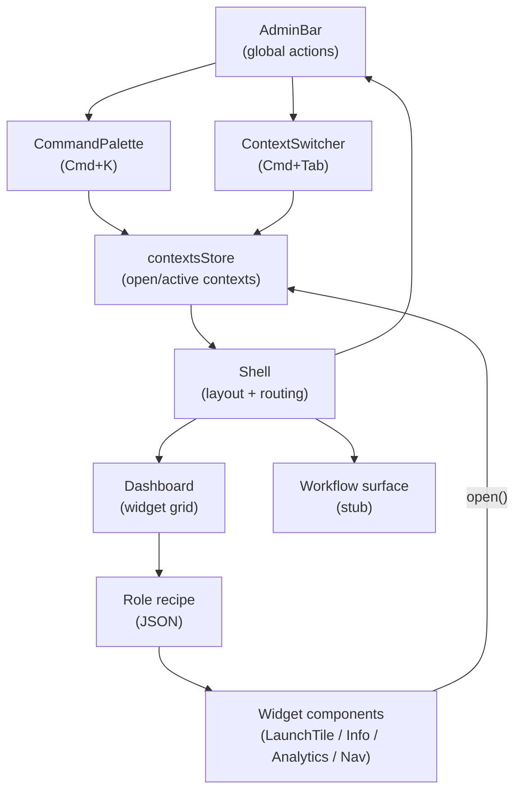
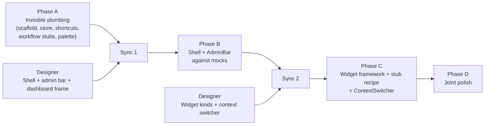

## 1. Scope of slice 1

This slice proves the **structural model**, not the content. Concretely it ships:

- A persistent **Elevated Admin Bar** with the four global capabilities (command, notifications, create, AI) plus a context-switcher trigger and user menu.
- A **Dashboard region** that demonstrates the widget anatomy with one stub of each widget type.
- A **context switching** mechanism: Cmd+K command palette (destination + action search) and a Cmd+Tab overlay listing open contexts, also openable from an admin bar button.
- **Stubbed workflow surfaces** so launching a widget opens a real "context" you can switch back to.

Deferred to later slices: realistic role-based widget content, real workflows, extensibility API, comparison harness vs. current wp-admin, AI-generated widgets.

## 2. Tech stack

- Vite + React + TypeScript
- Tailwind CSS v4 + coss/ui (`npx shadcn@latest init @coss/style`)
- Zustand for the contexts store (tiny, easy to swap)
- `cmdk` is already inside coss/ui's `Command` component
- No router library; the contexts store is the source of truth for active view (URL sync via `history.pushState` so deep links work — keeps the door open for WP routing later)

Rationale for "hybrid": data-driven widget definitions + a thin Shell layout layer means later we can re-render the same recipes inside a WP plugin (PHP→JSON for recipes, React island for the Shell).

## 3. Architecture



Key idea: every navigable destination — dashboard, settings, an edit page, a product editor — is a **Context** with `id`, `type`, `title`, `icon`, `params`. The Shell renders the active context; the switcher and palette mutate the store.

## 4. Directory layout

```
src/
  shell/
    Shell.tsx              // top-level layout
    AdminBar.tsx           // brand, palette, create, notifications, AI, switcher, user
    ContextSwitcher.tsx    // Cmd+Tab overlay (Sheet/Dialog from coss)
    CommandPalette.tsx     // wraps coss Command
    useShortcuts.ts        // Cmd+K, Cmd+Tab, Esc bindings
  contexts/
    store.ts               // zustand: openContexts[], activeId, open(), close(), focus()
    types.ts               // Context, ContextType
  widgets/
    types.ts               // Widget anatomy + typing model
    LaunchTile.tsx
    InfoWidget.tsx
    AnalyticsWidget.tsx
    NavWidget.tsx
    WidgetGrid.tsx
  recipes/
    storeManager.ts        // stub recipe (1 of each widget type)
    schema.ts              // Recipe = { role, widgets: WidgetDef[] }
  workflows/               // stub destinations
    AddProduct.tsx
    EditPage.tsx
    Settings.tsx
  app/
    main.tsx
    App.tsx
    globals.css            // coss tokens
  mocks/
    notifications.ts
    user.ts
```

## 5. Widget anatomy (typing model)

Locking this early because it's the most reusable contract:

```ts
type WidgetBase = {
  id: string;
  title: string;
  icon?: string;
  size?: 'sm' | 'md' | 'lg';   // grid span
  source?: string;             // who provided it (core / plugin id)
};

type LaunchTile  = WidgetBase & { kind: 'launch';  action: ContextRef };
type InfoWidget  = WidgetBase & { kind: 'info';    body: () => ReactNode };
type Analytics   = WidgetBase & { kind: 'analytics'; metric: MetricDef };
type NavWidget   = WidgetBase & { kind: 'nav';     items: NavItem[] };

type WidgetDef = LaunchTile | InfoWidget | Analytics | NavWidget;
```

A `WidgetGrid` switches on `kind` and renders the matching component. This is what later allows third parties (or AI) to contribute widgets via data.

## 6. Context switching model

- **Cmd+K** opens `CommandPalette` (coss `Command`) with two sections: *Go to* (all known destinations) and *Recent* (last 5 closed contexts). Acts on enter.
- **Cmd+Tab** (and admin-bar button) opens `ContextSwitcher` — a centred dialog listing currently *open* contexts with previews. Tab cycles, release to focus. This is the macOS-style power-user affordance the user asked for.
- Closing a context returns to the previous active one (LRU stack).

## 7. Admin Bar contents (left → right)

- Brand / home (returns to active dashboard)
- Context switcher button (shows count badge of open contexts)
- Spacer
- Command palette trigger (with `⌘K` `Kbd` hint)
- Create button (Menu: Page, Post, Product…) — stubbed actions open the relevant workflow context
- Notifications (Popover with mock list)
- AI assistant (Sheet placeholder)
- User avatar menu

Third-party action slot is sketched as a `<AdminBarSlot id="extras" />` registry but only documented, not wired in this slice.

## 8. Out of scope (explicit, to prevent scope creep)

- Real WordPress integration / PHP
- Actual role-specific recipes beyond one stub
- Functional workflows (Add Product, Edit Page render placeholders)
- Time-to-destination measurement harness
- Widget reordering / resizing UI
- Theming beyond default coss tokens
- Mobile layout (desktop-first)

## 9. Design + implementation workflow (interleaved)

We work in four phases. Phases A and "design sync 1" run in parallel.



**Sync 1 — what the designer provides**
- Application shell layout: admin bar height, main region padding, max-width vs. edge-to-edge, background treatment
- Admin bar composition: order, spacing, separators, icon-only vs. labelled, badge style, brand area
- Dashboard frame: grid columns, gutters, default widget heights, empty state

**Sync 2 — what the designer provides**
- One rendered example of each widget kind: LaunchTile, InfoWidget, AnalyticsWidget, NavWidget (header treatment, density, internal anatomy)
- Context switcher overlay: list vs. grid, preview thumbnails or just title+icon, active-item indicator, dismiss/select interactions

**Format**
- Figma preferred — design context can be pulled directly via the Figma MCP
- Static images are an acceptable fallback but lose token + layout hints

**Token alignment**
- Designer should work on top of coss/ui's default tokens (neutral colors, sidebar variables, Inter / Geist Mono) so divergence stays explicit and easy to override in `globals.css`

## 10. After slice 1

Subsequent slices, in order, would be:

1. Store Manager recipe with realistic widget content + one full Add Product workflow.
2. Content Editor recipe + side-by-side comparison view against a screenshot of current wp-admin (qualitative baseline for "time-to-destination").
3. Extensibility surface: documented APIs for registering admin-bar actions and widgets from external code.
4. Port-readiness pass: extract `recipes/` and widget definitions to JSON; document how a WP plugin would feed them.